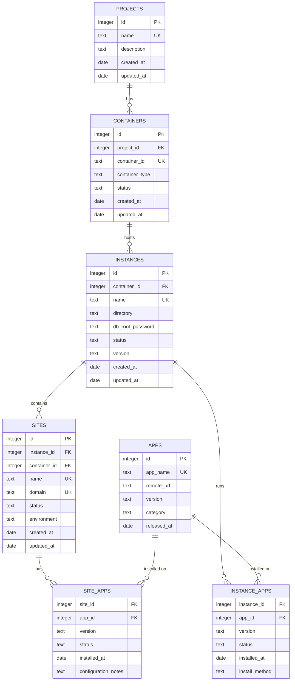

```mermaid
erDiagram
    PROJECTS ||--o{ CONTAINERS : "has"
    CONTAINERS ||--o{ INSTANCES : "hosts"
    INSTANCES ||--o{ SITES : "contains"
    INSTANCES ||--o{ INSTANCE_APPS : "runs"
    APPS ||--o{ INSTANCE_APPS : "installed on"
    SITES ||--o{ SITE_APPS : "has"
    APPS ||--o{ SITE_APPS : "installed on"
    
    PROJECTS {
        integer id PK
        text name UK
        text description
        date created_at
        date updated_at
    }
    
    CONTAINERS {
        integer id PK
        integer project_id FK
        text container_id UK
        text container_type
        text status
        date created_at
        date updated_at
    }
    
    INSTANCES {
        integer id PK
        integer container_id FK
        text name UK
        text directory
        text db_root_password
        text status
        text version
        date created_at
        date updated_at
    }
    
    SITES {
        integer id PK
        integer instance_id FK
        integer container_id FK
        text name UK
        text domain UK
        text status
        text environment
        date created_at
        date updated_at
    }
    
    APPS {
        integer id PK
        text app_name UK
        text remote_url
        text version
        text category
        date released_at
    }
    
    INSTANCE_APPS {
        integer instance_id FK
        integer app_id FK
        text version
        text status
        date installed_at
        text install_method
    }
    
    SITE_APPS {
        integer site_id FK
        integer app_id FK
        text version
        text status
        date installed_at
        text configuration_notes
    }
```

